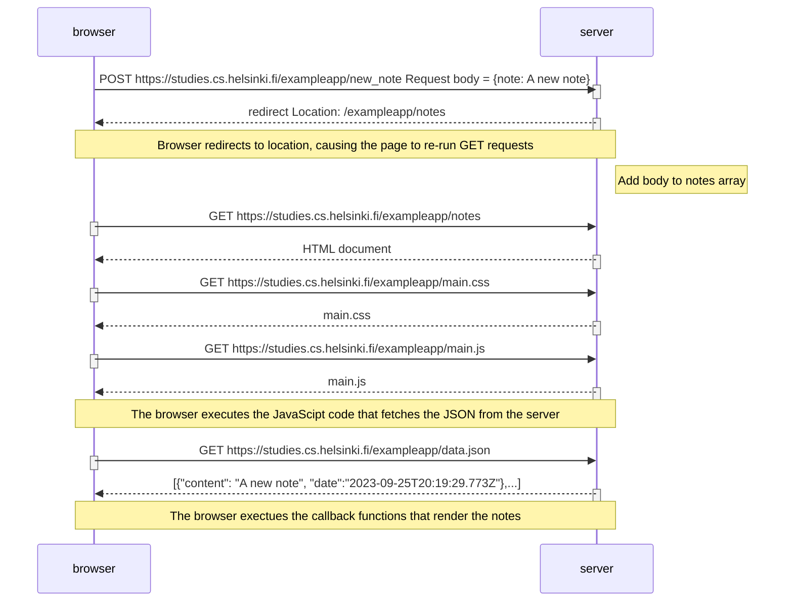

```mermaid
sequenceDiagram
    participant browser
    participant server

    browser->>server:POST https://studies.cs.helsinki.fi/exampleapp/new_note  Request body = {note: A new note}
    activate server
    deactivate server

    server-->>browser: redirect Location: /exampleapp/notes
    activate server
    deactivate server
    Note over server,browser: Browser redirects to location, causing the page to re-run GET requests
    Note right of server: Add body to notes array 
    
    

    browser->>server:GET https://studies.cs.helsinki.fi/exampleapp/notes
    activate browser
    deactivate browser

    server-->>browser:HTML document
    activate server
    deactivate server

    browser->>server:GET https://studies.cs.helsinki.fi/exampleapp/main.css
    activate browser
    deactivate browser

    server-->>browser:main.css
    activate server
    deactivate server

    browser->>server:GET https://studies.cs.helsinki.fi/exampleapp/main.js
    activate browser
    deactivate browser

    server-->>browser:main.js
    activate server
    deactivate server
    Note over server,browser: The browser executes the JavaScipt code that fetches the JSON from the server

    browser->>server:GET https://studies.cs.helsinki.fi/exampleapp/data.json
    activate browser
    deactivate browser

    server-->>browser:[{"content": "A new note", "date":"2023-09-25T20:19:29.773Z"},...]
    activate server
    deactivate server
    Note over server,browser: The browser exectues the callback functions that render the notes
```
