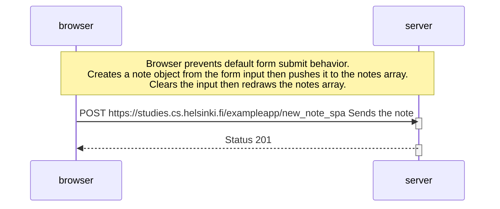

```mermaid
sequenceDiagram
    participant browser
    participant server
   
    Note over browser,server:Browser prevents default form submit behavior.<br/> Creates a note object from the form input then pushes it to the notes array.<br/>Clears the input then redraws the notes array.
    browser->>server:POST https://studies.cs.helsinki.fi/exampleapp/new_note_spa Sends the note
    activate server
    deactivate server
   
    server-->>browser: Status 201
    activate server
    deactivate server
   
```
