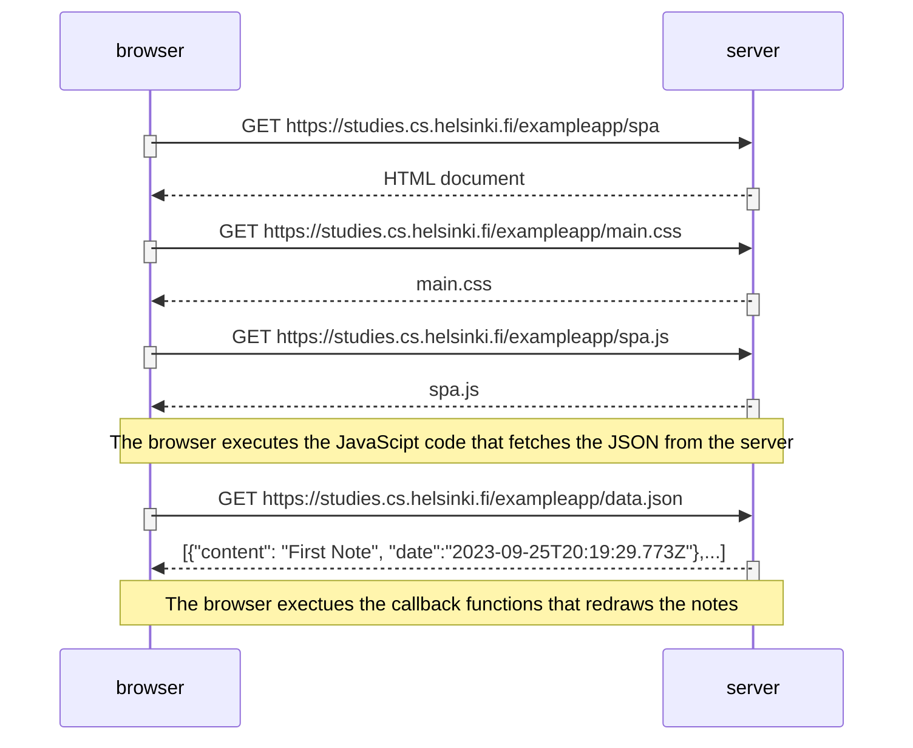

```mermaid
sequenceDiagram
    participant browser
    participant server

    browser->>server:GET https://studies.cs.helsinki.fi/exampleapp/spa
    activate browser
    deactivate browser

    server-->>browser:HTML document
    activate server
    deactivate server

    browser->>server:GET https://studies.cs.helsinki.fi/exampleapp/main.css
    activate browser
    deactivate browser

    server-->>browser:main.css
    activate server
    deactivate server

    browser->>server:GET https://studies.cs.helsinki.fi/exampleapp/spa.js
    activate browser
    deactivate browser

    server-->>browser:spa.js
    activate server
    deactivate server
    Note over server,browser: The browser executes the JavaScipt code that fetches the JSON from the server

    browser->>server:GET https://studies.cs.helsinki.fi/exampleapp/data.json
    activate browser
    deactivate browser

    server-->>browser:[{"content": "First Note", "date":"2023-09-25T20:19:29.773Z"},...]
    activate server
    deactivate server
    Note over server,browser: The browser exectues the callback functions that redraws the notes
```
